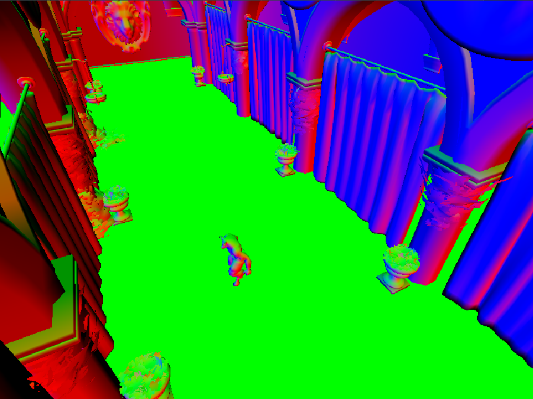
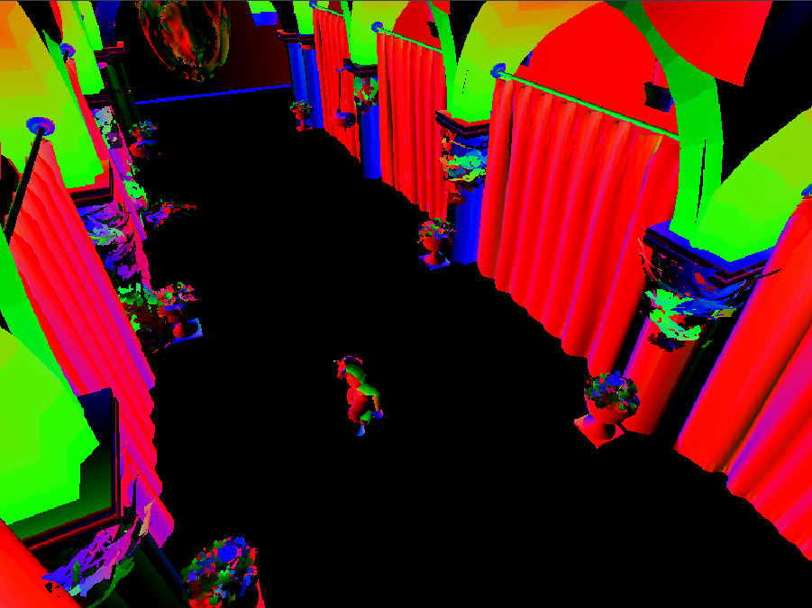
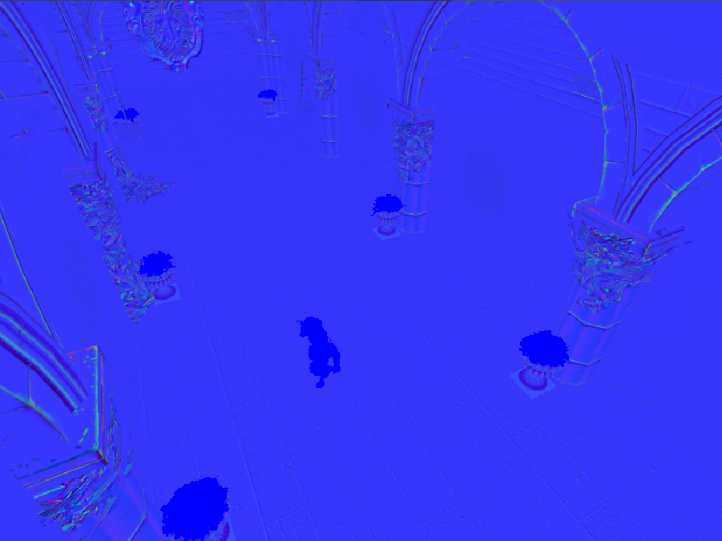
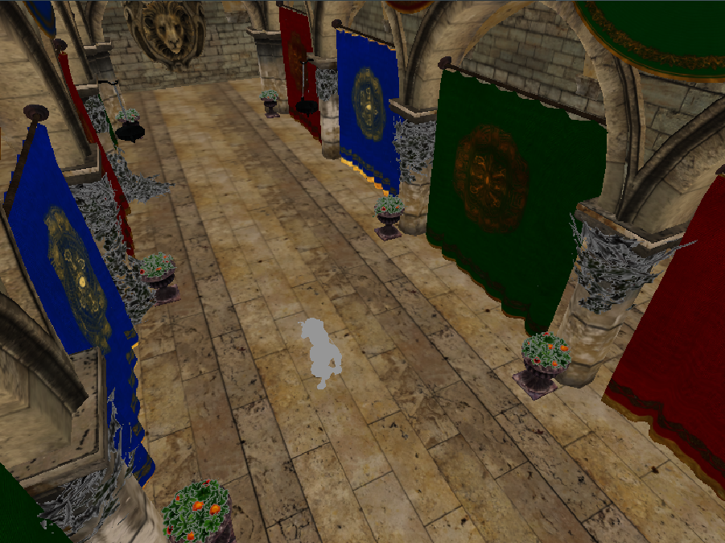
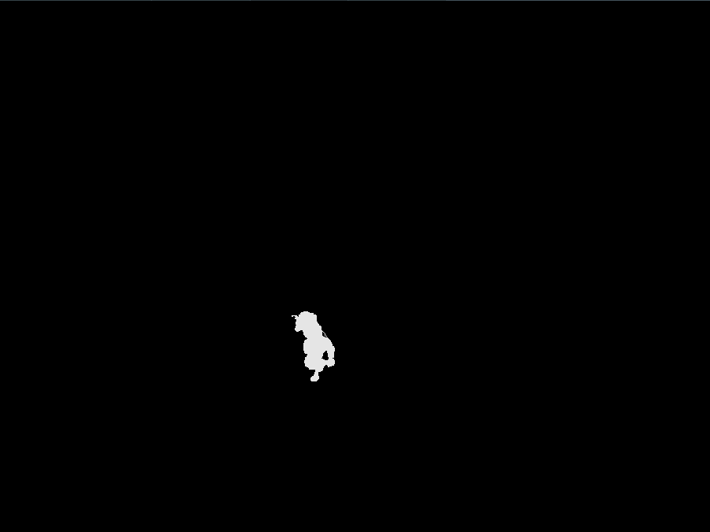
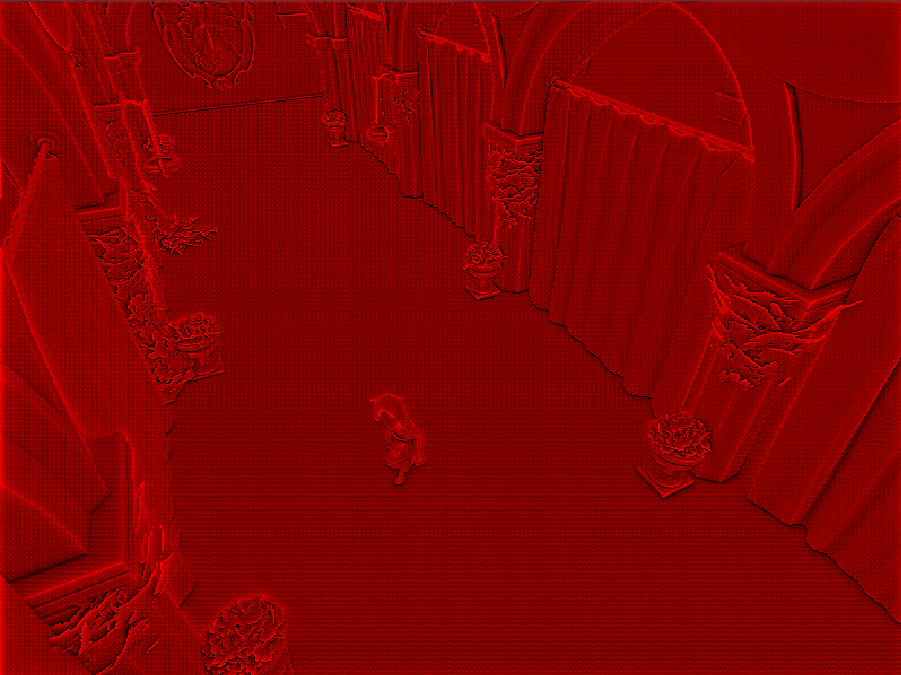
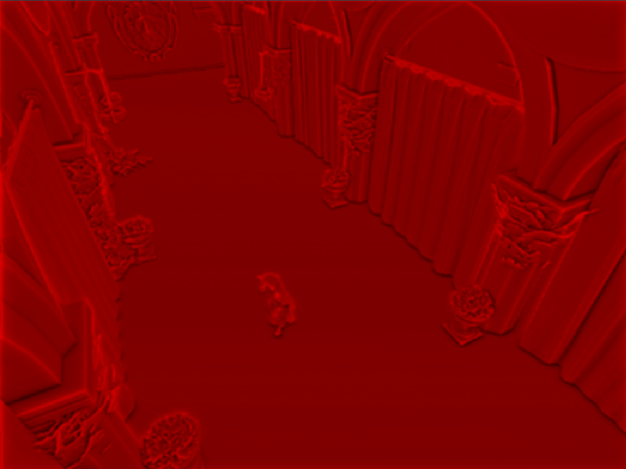
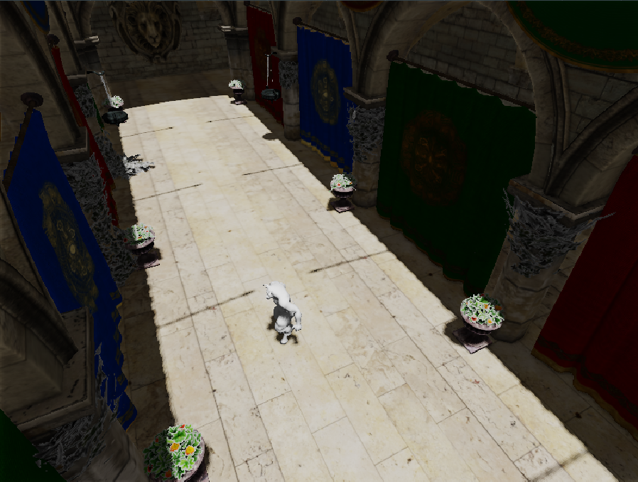
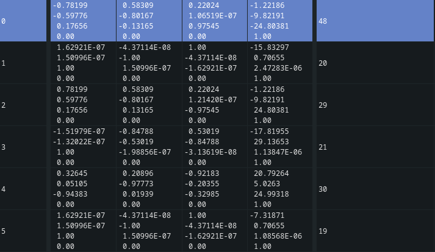
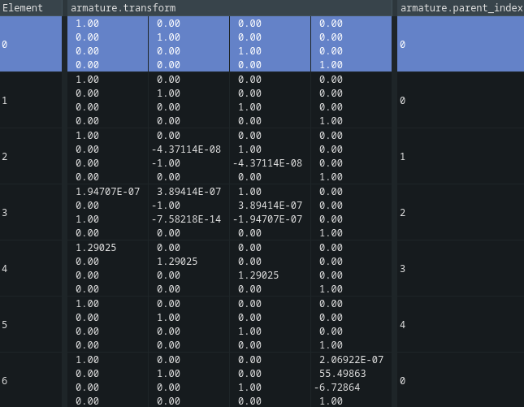

# Integrazione

Questa relazione spiega l'implementazione delle diverse techiche di illuminazione dei modelli e di animazione viste durante il corso.

L'applicazione presentata si compone di tre entità principali:

- la scena
- la pipeline grafica
- ImGUI per modificare le luci

La libreria ImGUI è stat usata per mostrare un memu interattivo con il quale modificare
colore, posizione e direzione delle luci per semplificare il debug e rispondere al
requisito di movimentare le luci all'interno dell'applicazione.

L'applicazione contiene un esempio pratico di utilizzo dei vari componenti implementati:

- carica il famoso modello 3D "Crytek Sponza"
- implementa una torcia (come spotlight) che segue il "giocatore"
- implementa una luce direzionale che rappresenta il sole
- implementa una luce spotlight posizionata per debug
- consente di navigare lo spazio con i tasti WASD
- Il minotauro esegue un salto ogni 2 secondi

L'implementazione delle tecniche è talvolta inefficiente e serve spòp per dimostrarle con chiarezza.

## Scena

Una scena non contiene codice OpenGL per il rendering, ma solo per le animazioni ed è una entità logica definita come istanza della classe Scene, questa contiene:

- mesh: modelli 3D (tri-meshes) caricate con assimp ed associati alle rispettive testure
- armature: il grafo orientato che contiene le relazioni padre-figlio delle entità nella scena
- animazioni: dati sulle animazione (ad esempio key frames)
- luci: una luce ambientale e un numero arbitrario di luci direzionali e spotlight
- camera: esprime l'osservatore della scena
- compute shader per l'animazione dei modelli

La classe Scene implementa metodi per deformare e visualizzare gli oggetti ad essa collegati durante
il rendering e poter caricare mesh durante l'esecuzione del programma.

## Model loading

Il model loading è implementato come metodo della classe Scene ed utilizza la libreria Assimp
per caricare i modelli 3D e dds_loader per caricare le texture.

Assimp è utilizzato senza calcolare la tangente per ogni vertice perchè i componenti
B e T della matrice BTN sono calcolati in un geometry shader: questo rende più facile l'integrazione delle normal map su modelli in movimento al costo di un geometry shader.

I geometry shader sono generalmente ritenuti deleteri per il frametime, ma questo vale su specifiche condizioni:

- Il numero di vertici cambia
- Il driver e l'hardware GPU non sono ottimizzati per il caso in cui il numero di vertici rimane uguale

dds_loader è una semplice ed incompleta libreria, implementata appositamente per il progetto,
per caricare texture memorizzate nel formato DirectDraw Surface: un formato molto popolare
nelle applicazioni DirectX.

Il model loader costruisce oggetti di tipo Animation (per descrivere le animazioni), Arnature (per descrivere la relazione tra i diversi componenti della risorsa caricata), Mesh (per descrivere l'oggetto 3D) e Material (per descrivere le proprietà che contribuiscono all'illuminazione delle mesh).

### Mesh

Gli oggetti di tipo mesh contengono le informazioni geometriche della mesh triangolare quali
la posizione dei vertici, la normale dei vertici e le coordinate UV delle tessiture associate
al modello e i dati per la deformazione di oggetti animati.

Dal punto di vista della API grafica OpenGL contiene:

- un VBO (vertex buffer object) un buffer dove sono memorizzati i dati sopra descritti come elementi contigui in memoria
- un IBO (index buffer object), anche chiamato element buffer object, che descrive l'ordine dei vertici nel VBO per formare la mesh
- un VAO (vertex array object) che descrive quali buffer sono associati alla mesh e il layout dei dati nel VBO e IBO

### Material

Gli oggetti di tipo Material descrivono le diverse tessiture da applicare al modello quando viene eseguito il processo di rendering, il diffuse e lo specular color da usare quando una texture non è disponibile per il modello.

Le texture sono memorizzate come texture OpenGL come membri delle varie istanze della classe Texture
ed usano il formato di compressione BC7 per risparmiare spazio in memoria.

## Camera

La camera è implementata come classi derivanti dalla classe base Camera, in particolare:

- SpectatorCamera: una camera che consente di muoversi nello spazio in modalità "free roam" e fa uso della prospettiva
- OrthoSpecatatorCamera: come la precedente, ma la matrice di proiezione è una matrice ortografica

Si occupa di calcolare un mat4 da usare all'interno della pipeline grafica.

## Luci

Diversi tipi di luci sono implementati come oggetti derivati dalla classe base Light, ho implementato:

- DirectionalLight: modellano luci con direzione uniforme, utili per rappresentare sorgenti luminose molto distanti come il Sole
- ConeLight: modellano luci che hanno una posizione nello spazio, una direzione e un angolo fuori dal quale la luce non ha alcun effetto
- AmbientLight: modella la luce di rimbalzo sulle superfici che contribuisce in maniera uniforme (a meno dell'occlusione) su tutti i punti della scena

## Pipeline

La pipeline grafica è il centro dell'algoritmo di rendering e si occupa di eseguire comandi OpenGL al fine di coordinare l'esecuzione dei diversi passi di rendering e di gestire le risorse ad essa associate, ad esempio ridimensionando i framebuffer utilizzati durante il rendering quando la dimensione della finestra su schermo cambia.

In questo contesto la "pipeline" è l'unione dell'esecuzione delle diverse pipeline grafiche, non una singolo programma.

La pipeline grafica di default si chiama "ShadowedPipeline".

### ShadowedPipeline

La pipeline "Shadowed" ha questo nome perchè contiene gli algoritmi necessari ad applicare le ombre sulla scena.

I passi di rendering sono i seguenti:

- 1.1 geometry pass
- 2.1 SSAO pass
- 2.2 SSAO blur pass
- 3.1 Ambient light pass
- 4.a Directional lights pass
- 4.b Spotlights pass
- 5.1 tone mapping
- 6.1 final pass

I diversi passi sono descritti di seguito, è però importante precisare che l'approccio scelto per l'illuminazione fa uso di due framebuffer usati in modo alternato come input ed output dei passi successivi a 2.2, in modo tale da usare come input di un passo di rendering il risultato del passo precedente, sfruttando il fatto che i contributi dei diversi tipi di luce sono modellati come somma dell'effetto della luce presa in considerazione.

#### 1.1 Geometry pass

Questo è il primo passo per un deferred rendering e popola il geometry buffer: una raccolta di diversi framebuffer, i quali a loro volta sono tessiture da applicare ad un quad che copre l'intera area dello schermo.

Ha questo nome perchè salva informazioni geometriche che vengono poi utilizzate dalle tecniche implementate in "screen space" come Screen Space Ambient Occlusion.

I framebuffer generati sono i seguenti:

- gPosition: l'insieme delle posizioni dei punti visibili dalla camera (di fatto la risoluzione al problema della visibilità)
- gNormalTangentspace: il valore della normale in tangentspace: vec(0, 0, 1) se non è presente una normal map
- gDiffuse: il valore della diffuse texture nel punto
- gSpecular: il valore della specular texture nel punto
- gNormal: la normale dei punti visibili dalla camera
- gTangent: la tangente dei punti visibili dalla camera: utile per il calcolo della illuminazione in tangent space
- gShininess: il coefficiente di lucentezza degli oggetti, usato per l'effetto speculare della luce.

Queste informazioni sono essenziali per il corretto svolgimento dei passi successivi e l'avere i punti di interesse su cui eseguire gli algoritmi di shading consente di risparmiare tempo di secuzione evitando di fare shading di punti non visibili a schermo.

Il framebuffer utilizzato viene attivato con *glBindFramebuffer()* prima di eseguire i comandi *glDraw()* sulle mesh della scena di cui eseguire il rendering.

I dati in ingresso alla pipeline sono:

- ModelMatrix: determina la matrice di trasformazione dei punti dal modelspace al worlspace
- NormalMatrix: svolge lo stesso compito del ModelMatrix sulle normali
- MVP: la matrice che trasforma le posizioni dei vertici dal modespace allo screen space

La matrice MVP è usata per risolvere il problema della visibilità lasciando il rasterization
a il depth buffer testing all'hardware.












#### 2.1 SSAO pass

Questo passo di rendering costruice il buffer SSAO: una texture che ricopre lo screen quad in cui
ogni punto ha un valore floating point tra 0 ed 1 che rappresenta la quantità di occlusione del punto geometrico corrispondente nel geometry buffer.

Si può pensare all'occlusione di un punto come il grado di "ostruzione" del un punto appartenente alla superficie di un ogggetto.

Il calcolo del valore di occlusione è eseguito come media di valori (campioni) di occlusione in punti appartenenti alla sfera
con centro nel punto di cui ci interessa sapere l'occlusione, dove un campione si ritiene occluso se nel GBuffer appare un oggetto con Z minore rispetto al punto scelto. Questa implementazione è simile a quella del famoso videogioco Crytek, io ho tuttavia optato per non usare il tangentspace nel passo di SSAO.

La generazione dei punti "casuali" viene eseguita da un algoritmo che applica la somma di un offset casuale, ma limitato
tra 0 ed N. Se tale punto non appartiene all'emisfero interessato le componenti x,y,z dell'offset vengono moltiplicate
per -1.0 per selezionare il punto geometricamente opposto (rispetto al punto di partenza) che di conseguenza appartiene
all'emisfero di interesse.

Gli offset sono generati deterministicamente da un seed casuale salvato in un piccolo buffer di dimensione 8x8 per poi essere applicato a tile:
questo introduce un rumore ad alta frequenza (che può essere descritto come un pattern regolare) nel buffer di output dell'algoritmo.



#### 2.2 SSAO blur pass

Questo passo esegue la media locale di valori adiacenti nell'SSAO buffer generato al punto 2.1 al fine di rimuovere il rumore ad alta frequenza introdotto dalla ripetizione regolare dei seed; il risultato viene salvato in un framebuffer riservato.



#### 3.1 Ambient light pass

L'ambien light pass popola con un valore iniziale uno dei due framebuffer usati nel calcolo dell'illuminazione della scena:
lo fa calcolando il contributo della luce ambientale, pesato in base all'occlusione nei punti della scena.

La formula matematica è semplicemente:

```c
o_LightpassOutput = u_Ambient * albedo * ssao_coeff;
```

Dove o_LightpassOutput è l'output parziale a cui i successivi passi sommeranno i contributi dell'illuminazione dalle varie fonti di luce, albedo è la diffuse texture, u_Ambient l'intensità luminosa uniforme in tutti i punti (ciò che l'ambient light rappresenta) e ssao_coeff è il coefficiente generato dai passi di rendering precedenti.

#### 4.a Directional lights pass

Questo passo calcola il contributo della luce direzione su ogni punto della scena presente nel GBuffer e si divide a sua volta in due sotto-passi: la creazione della shadowmap e l'applicazione del contributo se il punto da illuminare non è in ombra.

La shadowmap è una texture, popolata usandola come framebuffer (o render attachment) nel rendering delle mesh usando come matrice MVP una matrice che posiziona l'osservatore come se fosse la luce stessa.

Del rendering l'unico dato di interesse è la distanza dei punti dal punto di osservazione, quindi non viene eseguito alcuno shading e il depth buffer usato dalla scheda video è il dato di interesse.

La shadowmap è generata su una texture 2048x2048, quindi di dimensioni maggiori degli altri framebuffer perchè maggiore è la risoluzione e maggiore è la qualità delle obre e la texture non viene mai disegnata sullo schermo: siamo interessati al suo contenuto nella fase di calcolo del contributo della luce per sapere se scartare il contributo nei punti che invece faranno parte dell'immagine finale perchè presenti nel GBuffer.

La fase del calcolo del contributo della luce è logicamente composta da due passi: il calcolo della quantità di luce da moltiplicare con i termini diffuse e specular e il pre-test per escludere tale calcolo per i punti in ombra.

Un punto è in obra se nella shadowmap il rendering di quel punto produce un punto in lightspace non escludo dalla shadowmap dallo step di rasterization e se nelle medesime coordinate x,y della shadowmap non è presente un punto più vicino alla posizione usata come centro durante la generazione della shadowmap: questo si traduce in un test sul componente Z di tale punto.

Il passo è spiegato più dettagliatamente nella spiegazione della tecnica.

Il passo di rendering viene reiterato per ogni luce direzionale presente nella scena (utile per rappresentare mondi alieni con più soli per esempio); reiterandolo i contributi di ogni luce vengono sommati alla texture risultate.

#### 4.b Spotlights pass

Questo passo, come il precedente, si articola in due sotto-passi: la generazione della shadowmap e il calcolo del contributo della luce nei punti di interesse e qui descrivo le principali differenze tra i due passi.

La prima, e più importante differenza è la matrice MVP usata nel rendering della shadowmap e nel lighting pre-test: la matrice di proiezione usata è una matrice di prospettiva: questo perchè le luci di tipo spotlight hanno un angolo oltre il quale la luce non dà alcun contributo alla scena e di conseguenza imposto il FoV della projection matrix pari all'angolo definito nell'oggetto luminoso.

La scelta di usare il FoV pari all'angolo della luce è importante perchè massimizza la risoluzione
dell'importanza della luce (e quindi dell'ombra); per questo tipo di luce è molto importante che il framebuffer abbia base e altezza uguali per non "tagliare" la luce ed anche in questo caso la texture usata ha risoluzione maggiore rispetto a quella dello schermo.

L'implementazione fornita considera la sfera inscritta nella shadowmap come l'unica area di importanza:

```c
float distanceFromCenter = length(shadowTexCoord - vec2(0.5));
if (distanceFromCenter > 0.5) {
    o_LightpassOutput = result;
    return;
}
```

E' possibile modellare la luce di uno schermo escludendo il test della distanza.

#### 5.1 tone mapping

Il tone mapping è implementato con un fragment shader (applicato come post-process) sul risultato dell'ultimo calcolo del contributo luminoso qualunque sia l'ultimo passo eseguito, l'unica precondizione è che almeno ambient è stato eseguito.

L'algoritmo usato è quello di [Uncharted 2](https://64.github.io/tonemapping/) e il suo scopo è permettermi di comparare i risultati con scene generate da un altro engine grafico.

L'output è scritto in un framebuffer delle dimensione dello schermo.

#### 6.1 final pass

Il final pass si occupa di copiare il risultato del tonemapping sul framebuffer di default: quello che verrà usato dal compositor (nel caso di Linux) per mostrare a schermo il risultato finale.



## Animazioni

Le animazioni sono una parte molto importante in ogni motore di rendering ed esistono diversi modi per generarle; in questo progetto le animazioni sono implementate aggiornado la bone matrix per ogni osso in un compute shader prima dell'esecuzione della pipeline grafica.

Il compute shader in questione si occupa di rigenerare la bone matrix partendo dall'offset_matrix in bind pose e i dati sull'armatura (dedotta dallo scene graph).

Quando non si sta eseguendo alcuna animazione sul modello il compute shader eseguito è quello che genera la bone matrix in bind pose:

```glsl
#version 320 es

precision highp float;

layout (local_size_x = 32u, local_size_y = 1) in;

struct SkeletonGPUElement {
    mat4 offset_matrix;

    uint armature_node_index;
};

struct ArmatureGPUElement {
    mat4 transform;

    uint parent_index;
};

layout(std430, binding = 0) buffer OriginalSkeletonBuffer {
    SkeletonGPUElement bones[];
} original_skeleton;

layout(std430, binding = 1) buffer PerFrameSkeletonBuffer {
    mat4 offset_matrix[];
} per_frame_skeleton;

layout(std430, binding = 2) buffer ArmatureBuffer {
    ArmatureGPUElement armature[];
} armature_data;

void main() {
    // Each invocation processes one bone index (mapped from dispatch groups in the host).
    uint boneIndex = uint(gl_GlobalInvocationID.x);
    uint nbones = uint(original_skeleton.bones.length());
    if (boneIndex >= nbones) return; // out of bounds, do nothing

    // find the armature node corresponding to this bone index. We need to find it in order to walk the parent chain and compute the final transform for this bone.
    uint armature_starting_index = original_skeleton.bones[boneIndex].armature_node_index;
    uint armature_length = uint(armature_data.armature.length());

    uint current_armature_index = armature_starting_index;
    mat4 current_transform = mat4(1.0);

    while (true) {
        mat4 local = armature_data.armature[current_armature_index].transform;

        current_transform = local * current_transform;
        uint parent_index = armature_data.armature[current_armature_index].parent_index;
        if (parent_index == current_armature_index) {
            break; // reached root
        }
        current_armature_index = parent_index;
    }

    // Final skinning matrix: global transform * inverse-bind (original offset)
    per_frame_skeleton.offset_matrix[boneIndex] = current_transform * original_skeleton.bones[boneIndex].offset_matrix;

    return;
}
```

Ogni bone ha un ArmatureGPUElement associato, che a sua volta è parte di una gerarchia di elementi dello stesso tipo: per calcolare la global transform matrix basta percorrere tutti i nodi della gerarchia fino alla root accumulando i contributi dei vari nodi.

La nuova bone matrix si ottiene moltiplicando l'offset matrix per la global transform.

Il compute shader eseguito per calcolare la posizione attuale funziona in modo analogo, ma invece di usare il local transform dei nodi dell'armatura usa, per i nodi da animare, il local transform dettato dall'istante dell'animazione per cui si stanno calcolando le bone matrix (o il local transform originale se l'animazione non include quel nodo).

### Esempio di dati inviati al compute shader




