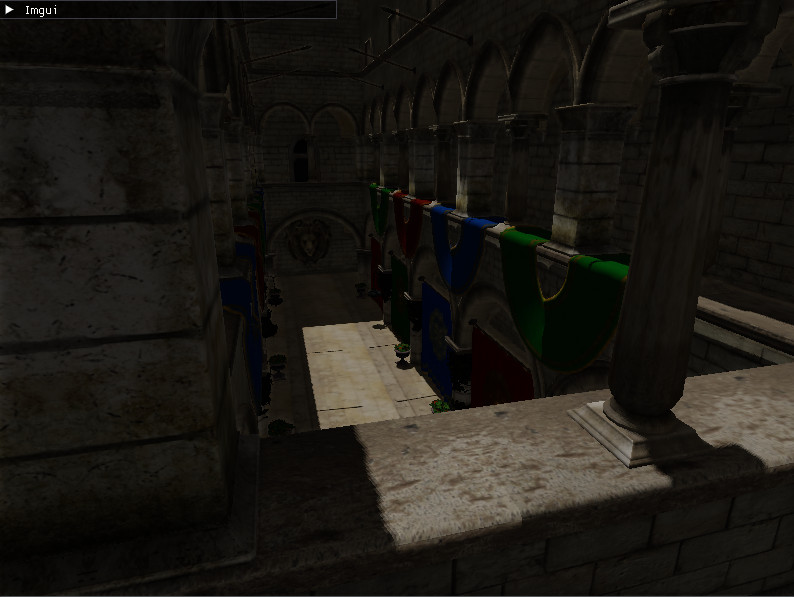

# Progetto

Repository da condividere per l'esame di programmazione grafica.

Denis Benato - VR473444

## Relazione Integrazione

La relazione sull'integrazione si trova in Integrazione.md

## Relazione shadow mapping

La relazione sullo shadow mapping si trova in SHADOW_MAPPING.md

## Esercizi

La descrizione degli esercizi svolti si trova in ESERCIZI.md

## Compilazione

Per compilare il progetto sono richieste le seguenzi dipendenze:

- sdl2
- glfw

```sh
mkdir build
cd build
cmake ..
cmake --build . --parallel
```

## Esecuzione

Per lanciare la scena di esempio:

```sh
./build/project resources/sponza/sponza.obj
```


