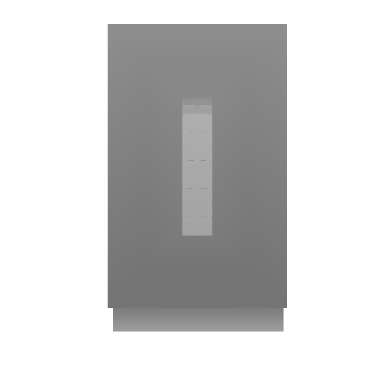
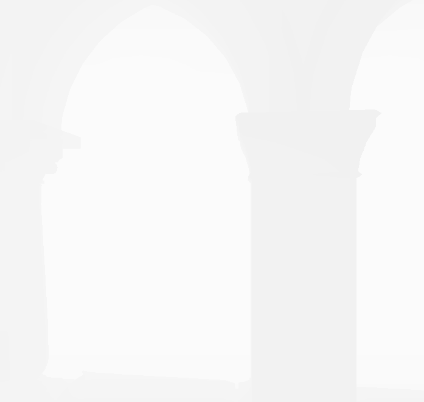
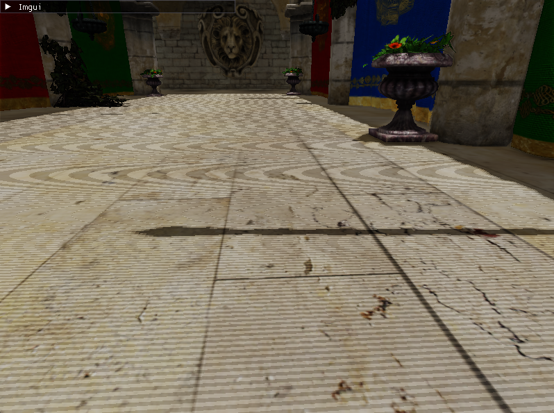
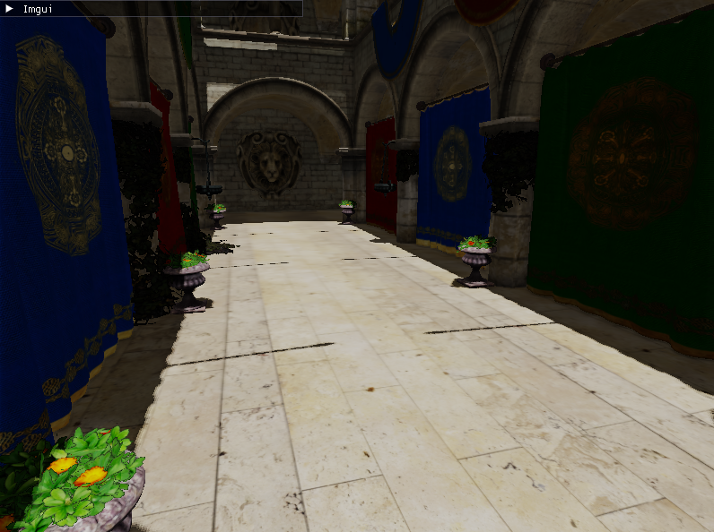
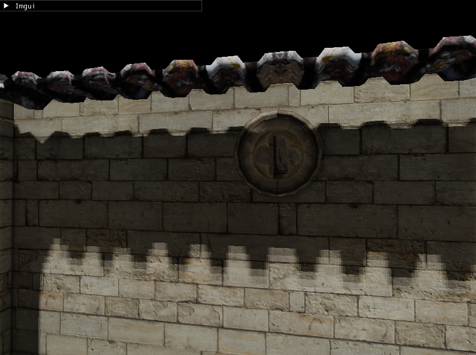
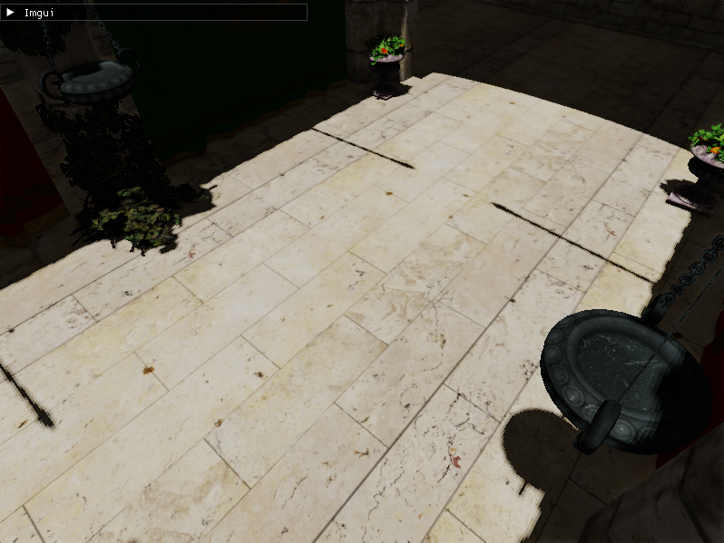
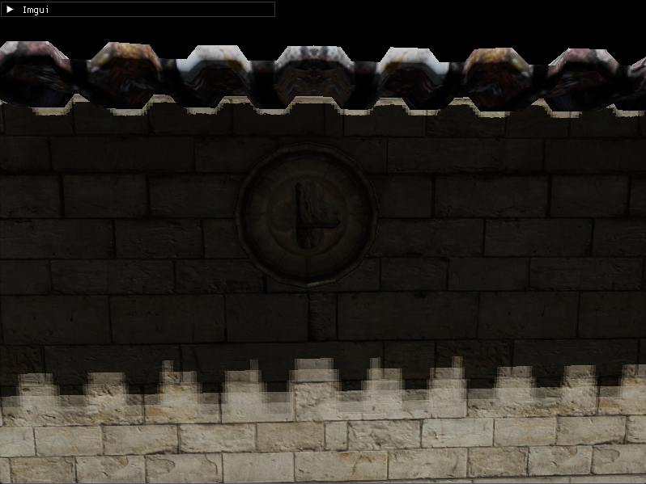
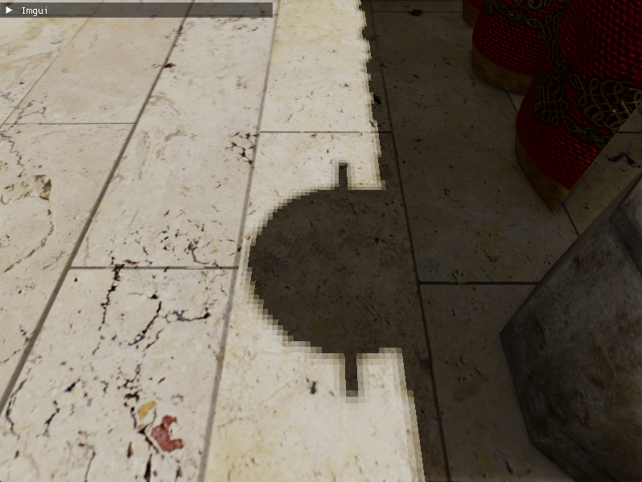
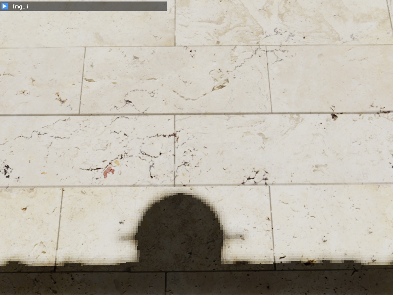
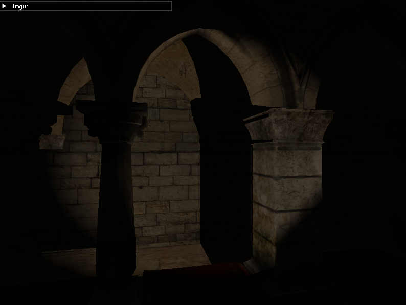

# Shadow Mapping

Shadow mapping è una tecnica per generare ombre partendo da una sorgente luminosa e la geometria della scena e si compone principalmente di due passi: la generazione della shadowmap ed il suo utilizzo durante l'applicazione della luce sulla scena.

L'algoritmo di shadow mapping deve essere adattato allo specifico tipo di luce che si intende implementare e di seguito descrivo l'implementazione per luci direzionale e spotlight.

La shadowmap è di fatto una texture nella quale ogni pixel descrive la distanza in prospettiva tra un oggetto della scena e la sorgente luminosa: è la risoluzione del problema della visibilità dal punto di vista della luce.

## Generazione della shadowmap

Generare la shadowmap richiede risolvere il problema della visibilità, e in computer graphics esistono principalmente due modi: una rasterization pipeline o una raytracing/ray casting pipeline; l'implementazione qui descritta è la prima creata quindi usando rasterization.

Dal punto di vista delle API grafiche le operazioni necessarie sono creare il framebuffer con un depth attachment e nessun color attachment, impostare le matrici di view e projection per poi eseguire l'operazione di *draw* (nel caso di OpenGL glDraw o glDrawIndexed o equivalenti) su ogni oggetto della scena.

Il motivo dietro al non utilizzo di color attachment risiede nel fatto che la tecnica si interessa solo ed esclusivamente al depth buffer, che deve essere usato per il depth testing durante il fragment test stage: il fragment shader per questi tipi di pipeline non deve eseguire alcuna operazione ne emettere output perchè l'output è già stato generato quando il fragment shader viene eseguito.

Le matrici di view e projection dipendono dal tipo di luce in considerazione e dalla risoluzione desiderata: in questo progetto è stata implementata la versione più semplice di shadowmapping, con problematiche descritte in seguito, ma esistono tecniche di shadowmapping come *cascading shadowmapping* che mirano a migliorare la risoluzione in maniera adattiva sulla zona della scena considerata.

L'unico altro dato necessario alla generazione della shadowmap è la model matrix da applicare ai modelli della scena; di fatto la stessa pipeline grafica funziona sia per luci direzionali che per spotlight:

### depth_only.vert

```c
#version 320 es

precision highp float;

layout(location = 0) in vec3 a_Position;

layout(location = 0) uniform mat4 u_LightSpaceMatrix;

void main() {
    gl_Position = u_LightSpaceMatrix * vec4(a_Position, 1.0);
}
```

### depth_only.frag

```c
#version 320 es

precision highp float;

void main() {
    // nothing to be done here except to NOT discard the fragment.
}
```

Per avere ombre coerenti con gli oggetti animati è tuttavia necessario usare gli stessi dati, e preferibilmente lo stesso vertex shader usato per il rendering del modello animato nel framebuffer finale.

### Shadowmap per una luce direzionale



In questa immagine possiamo chiaramente osservare la scena nella sua interezza vista dall'alto.

### Shadowmap per una spotlight



In questa immagine sono presenti dei pilastri presenti nella scena.

### MVP per luci direzionali

La matrice MVP per le luci direzionali si compone della model matrix della mesh che deve essere la stessa usata nel rendering nel gbuffer o forward rendered (non il caso di questo progetto), mentre le matrici view e projection sono scelte in base alla zona per cui si vuole che sia definita l'ombra e con quale risoluzione.

In generale il progrema della visibilità è risolto in un subset della intera scena, nel caso di una rasterization pipeline la fase di raster rimuove ciò che è fuori dalla inquadratura, è quindi necessario scegliere l'inquadratura adeguatamente tentando di includere solo le parti di interesse nel rendering finale per aumentare il più possibile la risoluzione di quel volume.

Nel progetto ho usato:

```c
const auto camera_pos = camera->getCameraPosition();
const auto light_distance = camera->getFarPlane();
const glm::vec3 light_pos = camera_pos - (
    dir_light.getDirection() * light_distance
);
const glm::mat4 light_view = glm::lookAt(
    light_pos,
    camera_pos,
    glm::vec3(0.0f, 1.0f, 0.0f)
);

const auto sqrt_3 = static_cast<glm::float32>(1.73205080757);
const glm::float32 aspect = 1.0f;
const glm::float32 top = camera->getFarPlane() / 2.0f;
const glm::float32 bottom = -top;
const glm::float32 right = top * aspect;
const glm::float32 left = -right;

const glm::mat4 light_proj = glm::ortho(
    left,
    right,
    bottom,
    top,
    camera->getNearPlane(),
    camera->getFarPlane() * sqrt_3
);
```

La view matrix è composta usando glm::lookAt dove il punto di osservazione è la posizione della camera traslata nella direzione inversa alla direzione della luce di zFar (riferita alla camera principale), ed il punto osservato è la posizione della camera principale: così mi assicuro che esista l'illuminazione intorno all'osservatore della scena. Questa strategia non è l'unica possibile: esiste la possibilità di generare la shadowmap solo per l'area visibile, escludendo la parte dietro all'osservatore.

La projection matrix è una matrice ortografica: non siamo interessati alla deformazione degli oggetti dovuti alla prospettiva perchè una luce direzione modella una luce uniforme in tutti i punti della scena.

In questo contesto la projection matrix definisce un volume attorno al punto osservato e riusa gli zNear e zFar della camera principale, fatto derivante dal posizionamento del centro nella creazione della view matrix.

### MVP per luci spotlight

La matrice MVP per le luci spotlight segue le stesse considerazioni della matrice MVP per le luci direzionali, ma il modo in cui vengono generate le componenti view e projection differisce a causa delle proprietà della luce da modellare.

Nel progetto è implementato così:

```c
const auto light_znear = cone.getZNear();
const auto light_zfar = cone.getZFar();
const auto light_angle = cone.getAngleRadians();
const auto aspect = static_cast<glm::float32>(m_shadowbuffer->getWidth()) /
    static_cast<glm::float32>(m_shadowbuffer->getHeight());
const glm::vec3 light_pos = cone.getPosition();
const glm::vec3 light_dir = cone.getDirection();
const glm::mat4 light_view = glm::lookAt(
    light_pos,
    light_pos + light_dir,
    glm::vec3(0.0f, 1.0f, 0.0f)
);

const auto light_proj = glm::perspective(
    light_angle,
    aspect,
    light_znear,
    light_zfar
);
```

Una luce spotlight (chiamata conica nel progetto) ha un origine ed una direzione: queste informazioni sono usate direttamente per costruire la view matrix.

La projection matrix è una matrice di prospettiva perchè sfruttiamo l'angolo di apertura della camera come l'angolo del cono di luce, mentre l'aspect ratio è la relazione tra la base e l'altezza della shadowmap: l'algoritmo funziona al meglio quando base=altezza quindi l'aspect è uguale a 1.0. zNear è arbitrario e zFar è la massima distanza alla quale la luce ha una incidenza: teoricamente i risultati migliori si ottengono con uno zFar calcolato dall'intensity falloff.

### Modifiche per luci puntiforme

Le luci puntiformi non sono implementate per motivi di tempo, ma seguono lo stesso principio delle luci spotlight, senza però limitare la forma della luce ad una circonferenza e avendo una shadowmap per faccia di un cubo centrato nell'origine della luce e la distanza centro cubo-centro faccia uguale a zNear; basta poi usare un angolo adeguato a coprire il volume attorno al punto.

## Calcolo dell'ombreggiatura

Una volta generata la shadowmap va applicata alla scena e la specifica implementazione dipende dal tipo di pipeline: deferred lighting, forward rendering o raytracing; nel progetto la pipeline grafica è del tipo deferred lighting, quindi per applicare una luce è necessario avere le seguenti informazioni:

- la shadowmap
- la view matrix della luce
- la projection matrix della luce
- la definizione della luce

in un forward renderer è necessario disporre anche della model matrix per il rendering dell'oggetto 3D.

Il principio fondamentale della applicazione della luce alla scena è calcolare l'illuminazione solo se il test dell'ombreggiatura da esito negativo, esempio per una luce direzionale:

```c
vec4 lightSpacePos = u_LightSpaceMatrix * vPosition_worldspace;
lightSpacePos /= lightSpacePos.w;
vec2 shadowTexCoord = lightSpacePos.xy * 0.5 + 0.5;
if (shadowTexCoord.x < 0.0 || shadowTexCoord.x > 1.0 || shadowTexCoord.y < 0.0 || shadowTexCoord.y > 1.0) {
    o_LightpassOutput = result;
    return;
}

vec2 texelPos = shadowTexCoord * vec2(float(shadowTextureDimensions.x), float(shadowTextureDimensions.y));
float closestDepth = texelFetch(u_LDepthTexture, ivec2(texelPos), 0).r;
float currentDepth = lightSpacePos.z * 0.5 + 0.5;

float shadow = (currentDepth - bias) > closestDepth ? 0.0 : 1.0;
```

Dove u_LightSpaceMatrix è la matrice View-Projection per trasformare il punto di interesse nel worldspace nel lightspace.

shadowTexCoord sono le coordinate UV del punto (in lightspace) nella shadowmap.

closestDepth è il risultato del sampling la shadowmap, currentDepth è la trasformazione del punto nel GBuffer in lightspace.

Il test è una semplice comparazione dei due valori per decidere se il punto è in ombra; lo scopo di *bias* è chiarito in seguito.



Il risultato è giusto nel concetto, ma ci sono zone dove l'ombra non è correttamente applicata: è un fenomeno simile nel concetto allo "z-fighting", chiamato __shadow acne__ ed è dovuto alla insufficiente risoluzione della rappresentazione in floating-pint del componente Z; esistono principalmente tre modi per risolvere questo problema:

1. Modifica della *projection matrix*: aumentare la risoluzione restringendo il volume interessato dallo shadow mapping
2. Modifica della *view matrix*: eseguire il rendering da un punto più ravvicinato (con possibile esclusioni di porzioni di scena che contribuirebbero all'ombra)
3. Modifica all'algoritmo: usare un offset, chiamato *bias* nel test dell'ombreggiatura.

Scegliendo l'opzione 3 si può osservare come l'aggiunta un piccolo bias di 0.004 ottiene un risultato decisamente migliore:



Questo però ha generato un problema la cui risoluzione non è banale dal punto di vista algoritmico: il __peter panning__



Questo fenomeno si chiama così perchè sembra che le obre siano staccate dall'oggetto che le sta generando.

E' fondamentale osservare che un bias molto piccolo rimuove il problema sulle superfici orientate perpendicolarmente alla direzione della luce, ma risulta in shadow acne in superfici parallele: possiamo sfruttare questa osservazione per applicare un bias dipendentemente dall'angolo di incidenza della luce sulla superficie (o sulla sua normale) in questo modo:

```c
float bias = max(0.002 * (1.0 - NdotL_neg), 0.00002);
```

Pur non eliminando completamente il problema del peter panning questo lo riduce considerevolmente ed elimina completamente il problema dello shadow acne.





A questo punto esistono diversi modi per risolvere i problemi rimanenti come la necessità di rigenerare la shadowmap ad ogni frame o il dover ridisegnare ogni mesh, ma ci concentriamo invece sul problema rimanente più vistoso: il fatto che le obre sono contornate da un effetto frastagliato a quadrati.

")

")

### PCF

La soluzione al problema delle ombre frastagliate si chiama __Percentage Closer Filtering__, una famiglia di filtri che mirano a rendere i bordi delle obre più naturali evitando l'effetto a quadrati/blocchi mostrato sopra.

L'implementazione pià semplice e quella usata nel progetto è fare la media dei pixel vicini a quello selezionato nella shadowmap:

```c
float pcf_shadow(float currentDepth, float bias, ivec2 center) {
    float shadow = 0.0;
    for(int x = -1; x <= 1; ++x) {
        for(int y = -1; y <= 1; ++y) {
            float pcfDepth = texelFetch(u_LDepthTexture, center + ivec2(x, y), 0).r;
            shadow += currentDepth - bias < pcfDepth ? 1.0 : 0.0;
        }    
    }
    shadow /= 9.0;
    return shadow;
}
```

Variando il numero di campioni variano i contorni delle ombre:






Più il numero di campioni è elevato e maggiore è l'effetto di sfumatura nei contorni delle ombre, ma a discapito della qualità della forma dell'ombra stessa: le ombre diventano sempre meno nitide e tendono a "fondersi" tra loro.

## Applicazione della shadowmap

Una volta scelto l'algoritmo di generazione del coefficiente di ombreggiatura la tecnica si completa applicando tale coefficiente al coefficiente di incidenza della luce:

```c
result += u_LightColor * vDiffuse * NdotL * shadow;
```

La formula sopra è valida per luci direzionali, quelle coniche e puntiformi seguono un principio simile:

```c
result += u_LightColor * vDiffuse * NdotL * attenuation * coneIntensity * shadow;
```

ma il calcolo dell'ombreggiatura e il principio generale rimangono invariati: il risultato finale sono fotogrammi dove le luci generano ombre:



## Conclusioni

Shadow mapping è una tecnica relativamente veloce da implementare, ma generare ombre di elevata qualità risulta complesso, specialmente per luci direzionali e spesso si rende necessario ricorrere a versioni più avanzate dell'algoritmo come ad esempio cascading shadow mapping che genera shadowmap con risoluzioni adeguate alla distanza degli oggetti rispetto alla camera.

Un ulteriore svantaggio è che la tecnica non prevede la generazione di "soft shadows" in modo accurato, e l'unico modo di avere quel tipo di ombre è tramite PCF su shadowmap ad elevata risoluzione, quindi con un dispendio di memoria notevole.

Dal punto di vista delle performance la tecnica ha una incidenza notevole sul framerate dell'applicazione in quanto tutti gli oggetti che contribuiscono all'ombra vanno renderizzati, per ogni luce, incrementando quindi il numero di triangoli processati.

Per ridurre il numero di triangoli di cui si esegue il rendering esistono due strade: pre-computare la visibilità degli oggetti ed eseguire il draw solo degli oggetti che influenzano la scena, ma questo significa mantenere diverse strutture dati per ogni tipo di luce; oppure usare LoD di mesh (versioni delle mesh che rappresentano lo stesso oggetto con numero diverso di triangoli) questo però costringe chi scrive il codice a decidere se il LoD è quello dell'oggetto rispetto alla camera, con possibili deformazioni delle ombre di oggetti lontani oppure rispetto alla sorgente luminosa, renderizzando più triangoli.

In conclusione quindi l'utilizzo di questa tecnica richiede una stretta collaborazione tra gli sviluppatori del motore di rendering e gli artisti che sviluppano i modelli 3D che formano la scena da visualizzare per ottenere un buon rapporto tra impatto sulle prestazioni, dispendio di memoria e qualità del prodotto del rendering.
